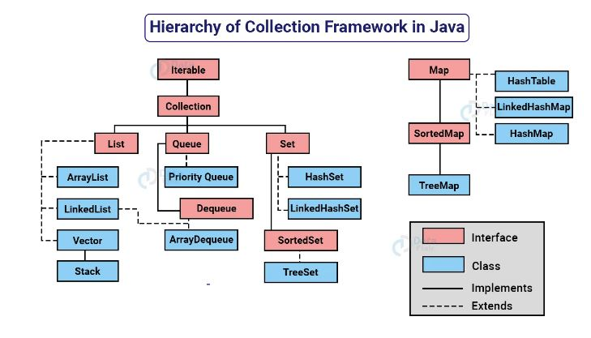

# #Java Collection

---

### Introduction

Colection merupakan sebuah Framework yang dibuat untuk menyimpan dan memanipulasi object (data). Collection biasanya digunakan pada sebuah data seperti mencari, meng-urutkan, meng-input dan menghapus. Java Collection merupakan kumpulan ***Interface*** dan menyediakan Class-class implementasinya.



[Source image](https://data-flair.training/blogs/collection-framework-in-java/)

---

## - ITERABLE INTERFACE

Merupakan ***Parent*** untuk semua ***Collection*** di java, Kecuali Map. Semua turunan

dari Iterable itu mendukung perulangan ***For-each***.

```java
package armul.java.collection;

import java.util.List;

public class IterableApp {
	public static void main(String[] args) {

		Iterable<String> Products = List.of("Pakaian", "Makanan", "minuman");

		for (var product : Products) {
			System.out.println(product);
		}
	}
}

```

---

## - COLLECTION INTERFACE

Merupakan kontrak untuk mamanipulasi data collection, seperti menambah, menghapus, serta mengecek isi data collection.

```java
package armul.java.collection;

import java.util.ArrayList;
import java.util.Collection;
import java.util.List;

public class CollectionApp {
	public static void main(String[] args) {

		Collection<String> products = new ArrayList<>();

		products.add("pakaian");
		products.add("makanan");
		products.addAll(List.of("minuman", "Electronic"));

		products.remove("Electronic");

		for (String product : products) {
			System.out.println(product);
		}

	}
}

```

---

## - LIST INTERFACE

merupakan struktur data collection yang memiliki sifat sebagai berikut:

* Element bisa duplikat.
* Data list berurut, sesuai yang dimasukkan.
* List Memiliki index.

Implement dari List yaitu Arraylist, linkedlist.

secara default List bersifat mutable, datanya bisa diubah.

> Mutable List

```java


package armul.java.collection;

import java.util.ArrayList;
import java.util.LinkedList;
import java.util.List;

public class ListApp {
	public static void main(String[] args) {

		List<String> products = new ArrayList<>();
//		List<String> Products = new LinkedList<>();

		products.add("pakaian");
		products.add("makanan");
		products.addAll(List.of("minuman", "Electronic"));

		products.remove("Electronic");

		for (String product : products) {
			System.out.println(product);
		}

	}
}

```
>immutable List

```java
package armul.java.collection;

import java.util.ArrayList;
import java.util.Collections;
import java.util.List;

public class ImmutableListApp {
	public static void main(String[] args) {

		List<Integer> list = Collections.emptyList();
		list.add(1); // error unsupported operation

		List<Integer> list2 = Collections.singletonList(1);
		list2.add(2); // error unsupported operation

		// MutableList<Integer>
		List<Integer> list3 = new ArrayList<>();
		list3.add(3);
		list3.add(4);
		// diubah menjadi immutableList
		List<Integer> immu = Collections.unmodifiableList(list3);
		immu.add(5); // error unsupported operation

		List<Integer> list4 = List.of(1, 2, 3, 4);
		list4.add(5); // error unsupported operation

	}
}
```

---

## - SET INTERFACE

merupakan struktur data yang berisikan elemen elemen yang unik, atau tidak boleh duplikat ketika datanya ada yang sama maka yang diterima hanya satu data,
dan Set tidak memiliki index. Implementasi dari Set Interface yaitu HashSet & LinkedHashSet. perbedaanya yaitu
jika HashSet tidak menjamin datanya terurut, namun sebaliknya jika LinkedHashSet datanya pasti berurut.

secara default Set bersifat mutable, datanya bisa diubah.

>Mutable Set

```java
package armul.java.collection;

import java.util.HashSet;
import java.util.LinkedHashSet;
import java.util.Set;

public class SetApp {
	public static void main(String[] args) {

//		Set<String> names = new HashSet<>();
		Set<String> names = new LinkedHashSet<>();
		names.add("Ari");
		names.add("mulian");
		names.add("Ari");
		names.add("mulian");

		for (String name : names) {
			System.out.println(name);
		}
	}
}

```

>Immutable

```java
package armul.java.collection;

import java.util.Collections;
import java.util.HashSet;
import java.util.Set;

public class ImmutableSetApp {
	public static void main(String[] args) {

		Set<String> empty = Collections.emptySet();
		empty.add("hello"); // Error 
		
		Set<String> single = Collections.singleton("one");
		single.add("two"); // Error 
		
		// Mutable
		Set<String> mutable = new HashSet<>();
		mutable.add("three"); 
		mutable.add("four");
		// diubah menjadi immutable
		Set<String> immutable = Collections.unmodifiableSet(mutable);
		
		Set<String> names = Set.of("ari", "mulian");
		names.add("manurung"); // Error 
		names.remove("ari"); // Error 
		
	}
}

```

## - SORTEDSET INTERFACE

merupakan turunan dari set, namun data data yang dimasukkan akan otomatis di urutkan secara ascending atua descending menggunakan comparator atau comparable.

```java
package armul.java.collection;

import armul.java.collection.data.Person;
import armul.java.collection.data.PersonComparator;

import java.util.Collections;
import java.util.SortedSet;
import java.util.TreeSet;

public class SortedSerApp {
	public static void main(String[] args) {

		SortedSet<Person> names = new TreeSet<>(new PersonComparator());
		names.add(new Person("ari"));
		names.add(new Person("muliasnyah"));
		names.add(new Person("manurung"));

		for (var name : names) {
			System.out.println(name.getName());
		}
		
		// Immutable
		SortedSet<Person> immutable = Collections.unmodifiableSortedSet(names);
		SortedSet<Person> empty = Collections.emptySortedSet();
	}
}

```

## - NAVIGABLE SET INTERFACE

merupakan turunan dari sortedset interface, yang membedakan jika navigable set itu memiliki method - method 
untuk menavigasi data seperti mereverse data, mengambil sebagian data, dll.

```java
package armul.java.collection;

import java.util.NavigableSet;
import java.util.Set;
import java.util.TreeSet;

public class NavigableSetApp {
	public static void main(String[] args) {

		NavigableSet<String> names = new TreeSet<>();
		names.addAll(Set.of("ari", "muliansyah", "manurung", "vania", "pasya"));
		
		for (String name : names){
			System.out.println(name);
		}
	}
}

```

## - QUEUE INTERFACE

merupakan implementasi dari struktur data antrian atau FIFO (First in First Out);

```java
package armul.java.collection;

import java.util.ArrayDeque;
import java.util.LinkedList;
import java.util.PriorityQueue;
import java.util.Queue;

public class QueueApp {
	public static void main(String[] args) {

		Queue<String> names = new ArrayDeque<>();
//		Queue<String> names = new PriorityQueue<>();
//		Queue<String> names = new LinkedList<>();


		names.add("Ari");
		names.add("mulian");
		names.add("b");

		for (String name = names.poll(); name != null; name = names.poll()) {
			System.out.println(name);
		}

		System.out.println(names.size());
	}
}

```

---

## DEQUE INTERFACE

merupakan doble ended queue yang bisa beroperasi dari depan atau belakang, bisa FIFO dan LIFO.

```java
package armul.java.collection;

import java.util.ArrayDeque;
import java.util.Deque;

public class DequeApp {
	public static void main(String[] args) {

		/**
		 * Stack -> LIFO ( Last in First out )
		 */
		Deque<String> stack = new ArrayDeque<>();
		stack.addLast("ari");
		stack.addLast("muliansyah");
		stack.addLast("manurung");

		System.out.println(stack.pollLast());
		System.out.println(stack.pollLast());
		System.out.println(stack.pollLast());

		/**
		 * Queue -> FIFO ( First in First out )
		 */
		Deque<String> queue = new ArrayDeque<>();
		stack.addLast("ari");
		stack.addLast("muliansyah");
		stack.addLast("manurung");
		
		System.out.println(stack.pollFirst());
		System.out.println(stack.pollFirst());
		System.out.println(stack.pollFirst());


	}
}
```

---

## - MAP INTERFACE

merupakan struktur data collection yang berisikan mapping antara key dan value, dimana key tersebut harus unik 
namun kita bebas untuk menentukan key tersebut.

implementasi dari Map Interface yaitu HashMap, WeakHashMap, IdentityHashMap, LinkedHashMap.

### *HashMap

merupakan implementasi Map yang melakukan distrubusi key menggunakan hashCode() function.

```java
import java.util.HashMap;
import java.util.Map;

public class HashMapApp {
	public static void main(String[] args) {

		Map<String,String> map = new HashMap<>();

		map.put("firstName", "Ari");
		map.put("middleName", "Muliansyah");
		map.put("lastName", "Manurung");

		System.out.println(map.get("firstName"));
		System.out.println(map.get("middleName"));
		System.out.println(map.get("lastName"));
	}
}
```

### *WeakHashMap

merupakan implementasi map yang mirip dengan HashMap, namun yang membedakan yaitu jika data key nya tidak digunakan lagi
maka akan secara otomatis data di WeakHashMap akan dihapus.

```java
package armul.java.collection;

import java.util.Map;
import java.util.WeakHashMap;

public class WeakHashMapApp {
	public static void main(String[] args) {

		Map<Integer,Integer> map = new WeakHashMap<>();

		for (int i = 0; i < 1_000_000; i++) {
			map.put(i,i);
		}

		System.gc();
		System.out.println(map.size());
	}
}

```

### *IdentityHashMap

merupakan implementasi Map Interface yang sama dengan HashMap, namun yang membedakannya adalah
dalam pengecekan kesamaan datanya, tidak menggunakan method equals(), melainkan menggunakan
operator == (reference equality), artinya data dianggap sama, jika lokasi di memory tersebut sama.

```java
package armul.java.collection;

import java.util.IdentityHashMap;
import java.util.Map;

public class IdentityHashMapApp {
	public static void main(String[] args) {

		Map<String, String> map = new IdentityHashMap<>();

		String key1 = "name.first";

		String name = "name";
		String dot = ".";
		String first = "first";

		String key2 = name + dot + first;

		System.out.println(key1.equals(key2));
		System.out.println(key1 == key2);

		map.put(key1, "ari");
		map.put(key2, "ari");

		System.out.println(map.size());
	}
}

```

### *LinkedHashMap

merupakan implementasi Map menggunakan double linked list, data di linkedHashMap akan lebih terprediksi
karena datanya akan berurutan sesuai urutan kita menyimpan data, namun ketika kita get datanya akan lambat karena akan melakukan
iterasi terlebih dahulu.

```java
package armul.java.collection;

import java.util.HashMap;
import java.util.LinkedHashMap;
import java.util.Map;

public class LinkedHashMapApp {
	public static void main(String[] args) {

		Map<String,String> map = new LinkedHashMap<>();

		map.put("first", "ari");
		map.put("last", "mulian");

		for (String key : map.keySet()) {
			System.out.println(key + "=" + map.get(key));
		}
	}
}

```

## SORTEDMAP INTERFACE

merupakan implementasi dari map dengan data key dirutkan sesuai comparable key
atau bisa menggunakan comparatot. konrit implementasi dari sortedmap yaitu treemap.

```java
package armul.java.collection;

import java.util.Comparator;
import java.util.SortedMap;
import java.util.TreeMap;

public class SortedMapApp {
	public static void main(String[] args) {

		Comparator<String> comparator = new Comparator<>(){

			@Override
			public int compare(String o1, String o2) {
				return o2.compareTo(o1);
			}
		};

		SortedMap<String, String> map = new TreeMap<>(comparator);

		map.put("middle", "Muliansyah");
		map.put("first", "Ari");
		map.put("last", "Manurung");

		for (String key : map.keySet()) {
			System.out.println(key + "=" + map.get(key));
		}
	}
}

```